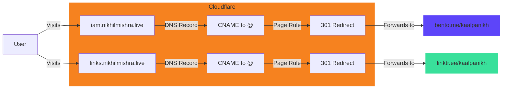

Have you ever wanted to use custom domains with free Bento or Linktree accounts? While these platforms charge for custom domains, I'll show you a clever workaround using Cloudflare's DNS and Page Rules! 🚀

## What We're Building

I'll show you how to set up:
- `iam.nikhilmishra.live` → redirecting to my Bento profile
- `links.nikhilmishra.live` → redirecting to my Linktree

Here's how the whole system works:



## Prerequisites

- A domain name (I'm using `nikhilmishra.live`)
- Domain nameservers pointed to Cloudflare
- A Cloudflare account (free plan works!)
- Bento/Linktree profiles

## Step-by-Step Guide

### 1. Set Up DNS Records

First, we need to create CNAME records in Cloudflare:

1. Log into your [Cloudflare Dashboard](https://dash.cloudflare.com)
2. Select your domain
3. Go to **DNS** → **Records**
4. Add these records:

For Bento:
```plaintext
Type: CNAME
Name: iam
Target: @
Proxy: ✅ Enabled (Orange Cloud)
```

For Linktree:
```plaintext
Type: CNAME
Name: links
Target: @
Proxy: ✅ Enabled (Orange Cloud)
```

> 💡 The orange cloud (Proxy enabled) is crucial for this to work!

### 2. Create Page Rules

Now for the magic - Page Rules will handle the forwarding:

1. Go to **Rules** → **Page Rules**
2. Create two rules:

For Bento:
```plaintext
URL Pattern: https://iam.yourdomain.com/*
Forward to: https://bento.me/yourusername
Status: 301 (Permanent Redirect)
```

For Linktree:
```plaintext
URL Pattern: https://links.yourdomain.com/*
Forward to: https://linktr.ee/yourusername
Status: 301 (Permanent Redirect)
```

### 3. Test It Out!

After DNS propagation (usually 5-10 minutes):
1. Visit your custom Bento domain
2. Visit your custom Linktree domain

Both should redirect seamlessly to your profiles! 🎉

## Troubleshooting Tips

If it's not working:
1. ✅ Verify the orange cloud is enabled for DNS records
2. ✅ Check page rules order (they execute top to bottom)
3. ✅ Clear your browser cache
4. ⏳ Wait for DNS propagation (up to 48 hours, usually much faster)

## Why This Works

This solution works because:
1. Cloudflare accepts any CNAME record, even if it points to your root domain
2. Page Rules can redirect before the DNS resolution completes
3. The proxied connection (orange cloud) allows Cloudflare to intercept and redirect requests

## Limitations

- You need a domain name (but you can get one for as low as $1/year!)
- Limited to Cloudflare's free plan limits (but they're generous)
- Some features might require paid Cloudflare plans

## The Code

I've documented this entire setup in a GitHub repository:
[custom-subdomain-forwarding](https://github.com/kaalpanikh/custom-subdomain-forwarding)

## Conclusion

Now you have professional-looking custom domains pointing to your Bento and Linktree profiles, completely free! This same technique can work for other services too - get creative! 🚀

---

If you found this helpful, follow me on:
- [GitHub](https://github.com/kaalpanikh)
- [Twitter](https://twitter.com/kaalpanikh)
- [Bento](https://bento.me/kaalpanikh)
- [Linktree](https://linktr.ee/kaalpanikh)

Drop a ❤️ if this helped you set up your custom domains!
